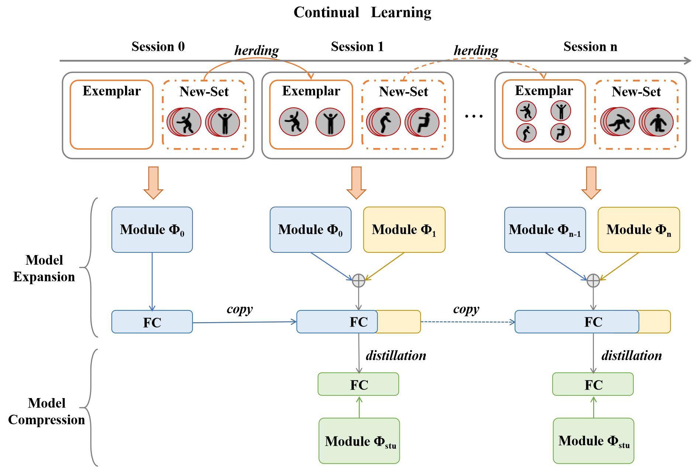

# ♾️ CAREC 
**CAREC: Continual Wireless Action Recognition with Expansion-Compression Coordination**


<p align="center">
  
</p>


In real-world applications, user demands for new functionalities and activities constantly evolve, requiring action recognition systems to incrementally incorporate new action classes without retraining from scratch. This class-incremental learning (CIL) paradigm is essential for enabling adaptive and scalable systems that can grow over time. However, Wi-Fi-based indoor action recognition under incremental learning faces two major challenges: catastrophic forgetting of previously learned knowledge and uncontrolled model expansion as new classes are added. To address these issues, we propose CAREC, a class-incremental framework that balances dynamic model expansion with efficient compression.


**📊 Dataset Link**: 
-   XRF55 pages: https://aiotgroup.github.io/XRF55/
-   XRF55 SDP: http://www.sdp8.org/Dataset?id=705e08e7-637e-49a1-aff1-b2f9644467ae


<p align="center">
  
</p>
An overview of the CAREC framework. Each incremental learning session consists of two alternating phases: feature expansion and feature compression. In the expansion phase, a new backbone is trained to incorporate new classes, while in the compression phase, knowledge from multiple backbones is distilled into a compact student model. The process supports lifelong learning without growing model size.


| Method               | Session 0 | Session 1 | Session 2 | Session 3 | Session 4 |
|-----------------------|-----------|-----------|-----------|-----------|-----------|
| **Baseline**          | 89.67     | 38.84     | 26.97     | 21.83     | 16.25     |
| iCaRL            | 90.41     | 74.09     | 66.90     | 63.68     | 63.49     |
| BiC             | 86.11     | 64.91     | 52.56     | 50.10     | 44.35     |
| UCIR             | 88.07     | 77.16     | 69.24     | 61.73     | 63.58     |
| BEEF             | 89.81     | 73.11     | 63.46     | 57.72     | 53.73     |
| CCS             | 87.48     | 75.02     | 66.59     | 59.16     | 60.45     |
| CAREC  | 89.44     | 81.36     | 75.00     | 63.46     | 67.84     |


## 🏃‍♂️ Running the Code:

1. Modify the paths in `basic_config.json` to match your system setup.
2. To **train** the model:
```bash
   python script/train_run.py
```
3. To **test** the model:

Copy the path of the trained model and specify it in `test_run.py` before running the test:

```
   test_model_list = [XXXXX]
```

```bash
   python script/test_run.py
```
## 📞 Support
If you encounter any issues or need assistance, feel free to reach out to us.


## 📖 Related Work
```
@article{wang2024xrf55,
  title={Xrf55: A radio frequency dataset for human indoor action analysis},
  author={Wang, Fei and Lv, Yizhe and Zhu, Mengdie and Ding, Han and Han, Jinsong},
  journal={Proceedings of the ACM on Interactive, Mobile, Wearable and Ubiquitous Technologies},
  volume={8},
  number={1},
  pages={1--34},
  year={2024},
  publisher={ACM New York, NY, USA}
}

@article{fu2024ccs,
  title={CCS: Continuous Learning for Customized Incremental Wireless Sensing Services},
  author={Fu, Qunhang and Wang, Fei and Zhu, Mengdie and Ding, Han and Han, Jinsong and Han, Tony Xiao},
  journal={arXiv preprint arXiv:2412.04821},
  year={2024}
}

```

